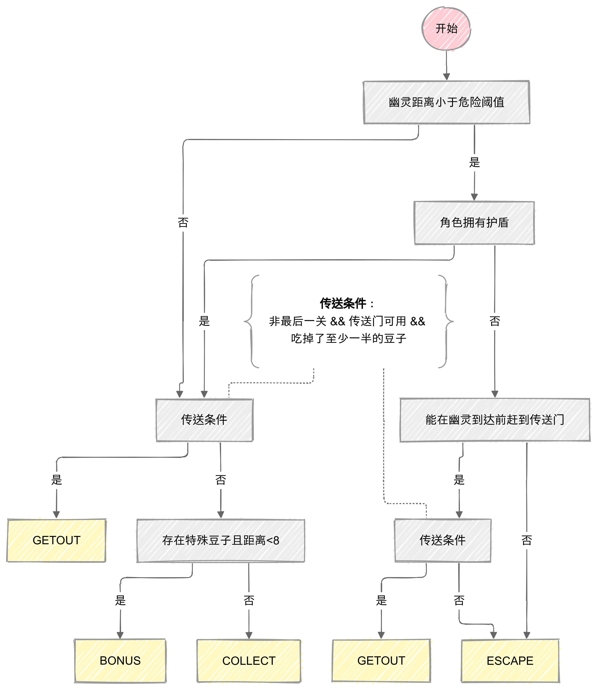

# Rollman开发指南
本文档为Rollman的开发指南。本文档基于热身赛sdk进行开发，sdk的使用说明可以参考引导文档sdk部分的对应文档。


## stage0: 利用好提供的封装

在 `gamedata.py` 中，我们已经给出了一些有助于编写 ai 程序的常量封装。它能避免我们过于局限于底层的实现细节，同时也可以大幅增强代码的可读性。
以下是一些选手在开发 AI 时会直接使用的常量封装示例:

### 操作相关常量

- `Direction` 枚举类定义了可用的移动方向:
  ```python
  class Direction(enum.Enum):
      STAY = 0    # 原地不动
      UP = 1      # 向上移动
      LEFT = 2    # 向左移动
      DOWN = 3    # 向右移动
      RIGHT = 4   # 向下移动
  ```
- `Update` 枚举类定义了每个方向对应的坐标偏移:
  ```python
  class Update(enum.Enum):
      STAY = (0, 0)    # 原地不动
      UP = (1, 0)      # 向上移动一格
      LEFT = (0, -1)   # 向左移动一格
      DOWN = (-1, 0)   # 向下移动一格
      RIGHT = (0, 1)   # 向右移动一格
  ```
- `OPERATION_COUNT = 5`: 总共有 5 种可用操作(上下左右不动)

例如，如果选手想要枚举所有可能的移动方向并选择最优的一步，可以这样写:

```python
# 枚举所有方向,选择最优移动
best_direction = Direction.STAY  # 默认原地不动
max_score = float('-inf')

# 遍历所有可能的移动方向
for direction in Direction:
    # 获取移动后的新坐标
    dx, dy = Update[direction.name].value
    new_x = current_x + dx
    new_y = current_y + dy

    # 计算该方向移动的得分
    score = evaluate_move(new_x, new_y)

    # 更新最优移动方向
    if score > max_score:
        max_score = score
        best_direction = direction

# 返回最优移动方向对应的数字编号
return best_direction.value
```

### 技能相关常量

- `Skill` 枚举类定义了可用的技能类型:
  ```python
  class Skill(enum.Enum):
      DOUBLE_SCORE = 0  # 智慧圣典(双倍得分)
      SPEED_UP = 1      # 疾风之翼(加速)
      MAGNET = 2        # 智引磁石(吸引效果)
      SHIELD = 3        # 护学之盾(护盾)
  ```
- `DEFAULT_SKILL_TIME`: 所有技能的持续时间均为 10 轮

例如，如果选手想要判断当前是否处于护盾状态，可以这样写:

```python
if game_state.pacman_skill_status[Skill.SHIELD.value] > 0:
    # 处于护盾状态
    pass
```

### 地图元素常量

- `Space` 枚举类定义了地图上的各类元素:
  ```python
  class Space(enum.Enum):
      WALL = 0          # 墙壁
      EMPTY = 1         # 空地
      REGULAR_BEAN = 2  # 知识金币(1分)
      BONUS_BEAN = 3    # 双倍荣耀币(2分)
      SPEED_BEAN = 4    # 疾风之翼豆子
      MAGNET_BEAN = 5   # 智引磁石豆子
      SHIELD_BEAN = 6   # 护学之盾豆子
      DOUBLE_BEAN = 7   # 智慧圣典豆子
      PORTAL = 8        # 传送门
  ```

### 常用豆子集合

- `BEANS_ITERATOR`: 所有豆子的类型列表
- `SPECIAL_BEANS_ITERATOR`: 所有特殊豆子(含双倍荣耀币)的类型列表
- `SKILL_BEANS_ITERATOR`: 所有技能豆子的类型列表

例如，选手可以封装一些常用的地图判断函数:

```python
def is_wall(x, y):
    return game_state.board[x][y] == Space.WALL.value

def is_empty(x, y):
    return game_state.board[x][y] == Space.EMPTY.value
```

还可以统计地图上的特殊豆子数量:

```python
def count_special_beans(game_state):
    return sum(1 for x, y in game_state.board if game_state.board[x][y] in SPECIAL_BEANS_ITERATOR)
```

### 关卡相关常量

- `MAX_ROUNDS`: 每关的最大轮数限制 `[0, 500, 400, 300]`
- `BOARD_SIZES`: 每关的地图大小 `[0, 38, 29, 20]`
- `PORTAL_ACTIVATION_ROUNDS`: 传送门激活所需轮数 `[0, 60, 50]`

这些常量的使用可以让代码更加清晰易读,避免使用魔法数字。

## stage1: 实现一个能运行的 ai

### Rollman

我们首先实现一个能够在平台上运行的 agent。

根据 sdk 的文档，我们需要实现一个 ai 函数，该函数接收一个 GameState 类型的对象，返回一个<b>长度为 1</b>的数组，数组元素为`[0, 4]`之间的整数。我们可以使用随机采样实现该函数：

```python
# ai.py
def ai_func(game_state: GameState):
    """
    Args:
        game_state (GameState): 当前的游戏局面对象

    Returns:
        list: 包含一个操作序号的数组，范围在[0, 4]之间
    """
    action = random.randint(0, 4)
    return [action]
```

### 幽灵

我们首先实现一个能够在平台上运行的 agent。

根据 sdk 的文档，我们需要实现一个 ai 函数，该函数接收一个 GameState 类型的对象，返回一个<b>长度为 3</b>的数组，数组元素为`[0, 4]`之间的整数。我们可以使用随机采样实现该函数：

```python
# ai.py
def ai(game_state: GameState):
    """
    Args:
        game_state (GameState): 当前的游戏局面对象

    Returns:
        list: 包含一个操作序号的数组，范围在[0, 4]之间
    """
    action = [random.randint(0, 4) for _ in range(3)]
    return action
```

此时我们已经实现了一个能运行的 ai，但是很明显随机移动的 ai 不足以取得好的效果，下面我们实现一个有策略的 ai。

## stage2：实现一个有策略的 ai

接下来我们会进一步实现能够进行基本的博弈的 ai。

### Rollman

在示例中，我们实现了一个基于状态机的 AI 来控制卷王。这个 AI 会根据当前游戏局面，动态切换不同的行为状态，并使用评分函数来选择最优的移动方向。

```python
class AIState(Enum):
    # 收集普通豆子模式，在安全时主动寻找并吃掉普通豆子
    COLLECT = "COLLECT" 
    # 逃离幽灵模式，当检测到附近有幽灵威胁时，优先考虑逃离
    ESCAPE = "ESCAPE" 
    # 收集特殊豆子模式，发现高价值的特殊道具时会优先获取
    BONUS = "BONUS" 
    # 逃离传送门模式，在合适的时机通过传送门进入下一关
    GETOUT = "GETOUT" 
```

根据以上的状态定义，我们需要相应的实现**状态更新**与**位置评估**。

> 在下述实现中，我们主要使用A*算法作为搜索寻路的工具。实际上，你也可以尝试不同的搜索算法，它们在不同场景下有不同的表现。

#### 状态更新

状态更新的要点在于根据幽灵距离、特殊豆子位置、护盾状态等因素动态切换状态，在不同状态下使用不同的评分权重。

```python
# 状态权重
self.weights = {
    AIState.COLLECT: {"ghost": 1.0, "bean": 1.5, "bonus": 1.5},
    AIState.ESCAPE: {"ghost": 3.0, "bean": 0.8, "bonus": 1.0},
    AIState.BONUS: {"ghost": 0.8, "bean": 1.5, "bonus": 2.0},
    AIState.GETOUT: {"ghost": 1, "bean": 1, "bonus": 1},
}
# 特殊豆子价值
self.bean_values = {
    3: 4.0,  # BONUS_BEAN
    4: 3.0,  # SPEED_BEAN
    5: 2.5,  # MAGNET_BEAN
    6: 3.0,  # SHIELD_BEAN
    7: 2.5,  # DOUBLE_BEAN
}
```

基于自定义的因子与权重，我们可以实现状态的更新。用状态转移图表示如下：


具体的代码实现如下：
```python
def update_state(self, game_state: GameState):
    """更新游戏状态"""
    pacman_pos = np.array(game_state.pacman_pos)
    ghosts_pos = np.array(game_state.ghosts_pos)
    # 计算威胁程度
    ghost_distances = [
        len(
            # 通过A*搜索计算幽灵距离
            self.a_star_search(
                np.array(pacman_pos), np.array(ghost_pos), game_state
            )
        )
        for ghost_pos in game_state.ghosts_pos
    ]
    min_ghost_distance = min(ghost_distances)
    # 寻找特殊豆子
    special_bean = self.find_nearest_special_bean(game_state)
    # 检查是否有护盾状态
    has_shield = game_state.pacman_skill_status[Skill.SHIELD.value] > 0
    # 状态机转换逻辑
    if min_ghost_distance < self.GHOST_DANGER_DISTANCE and not has_shield:
        # 如果可以在幽灵到达前到达传送门，优先选择GETOUT
        if (
            game_state.level < 3
            and self.can_getout_before_ghosts(game_state)
            and game_state.portal_available
            and self.count_remaining_bean(game_state) < self.init_bean_num * 0.5
        ):
            self.current_state = AIState.GETOUT
        else:
            self.current_state = AIState.ESCAPE
    elif (
        game_state.level < 3
        and game_state.portal_available
        and self.count_remaining_bean(game_state) < self.init_bean_num * 0.5
    ):
        self.current_state = AIState.GETOUT
    elif special_bean and special_bean[1] < 8:
        self.current_state = AIState.BONUS
    else:
        self.current_state = AIState.COLLECT
```

#### 位置评估

位置评估的要点在于根据当前状态，计算不同位置的价值。在这个过程中，我们希望考虑尽可能丰富、全面的因素，做出较为合理的决策。

对价值的计算包括：
- 幽灵威胁（越近威胁越大）
- 豆子价值（越近价值越大）
- 重复访问惩罚（越近惩罚越大）
- 特殊状态下的特殊行为（逃离模式下远离幽灵，收集模式下靠近豆子）

最后我们选择所有**合法移动方向**中价值最大的作为移动方向

```python
def evaluate_position(self, pos, game_state):
    """评估位置的价值"""
    pacman_pos = np.array(game_state.pacman_pos)
    weights = self.weights[self.current_state]
    ghost_distances = [
        # 通过A*搜索计算幽灵距离
        len(self.a_star_search(pos, np.array(ghost_pos), game_state))
        for ghost_pos in game_state.ghosts_pos
    ]
    min_ghost_distance = min(ghost_distances)
    ghost_score = (-4) * weights["ghost"] / (min_ghost_distance + 1)

    # 计算周围豆子的价值
    bean_value = 0
    scan_range = 5
    for dx in range(-scan_range, scan_range + 1):
        for dy in range(-scan_range, scan_range + 1):
            new_x, new_y = int(pos[0] + dx), int(pos[1] + dy)
            if (
                0 <= new_x < game_state.board_size
                and 0 <= new_y < game_state.board_size
            ):
                bean_type = game_state.board[new_x][new_y]
                if bean_type in BEANS_ITERATOR:  # 有豆子
                    distance = abs(dx) + abs(dy)
                    if bean_type in SPECIAL_BEANS_ITERATOR:  # 特殊豆子
                        bean_value += self.bean_values[bean_type] / (distance + 1)
                    elif bean_type == Space.REGULAR_BEAN.value:  # 普通豆子
                        bean_value += 1 / (distance + 1)

    # 避免重复访问
    pos_tuple = tuple(pos)
    repeat_penalty = 0
    visit_count = self.history.count(pos_tuple)
    repeat_penalty = -8 * visit_count
    final_score = ghost_score + bean_value * weights["bean"] + repeat_penalty

    # 如果是逃离模式，确保远离幽灵
    if self.current_state == AIState.ESCAPE:
        if min_ghost_distance < self.GHOST_DANGER_DISTANCE:
            final_score -= (self.GHOST_DANGER_DISTANCE - min_ghost_distance) * 10

    # 如果是GETOUT模式，确保尽快到达传送门
    if self.current_state == AIState.GETOUT:
        portal_pos = np.array(game_state.portal_coord)
        dist_to_portal = np.linalg.norm(pos - portal_pos)
        final_score += 30 / (dist_to_portal + 1)
    return final_score
```

注意：按照要求，我们的 choose_move 函数返回一个长度为 1 的列表，并自定义导出名称为 ai_func。

### 幽灵

相较于卷王，幽灵的控制更为“精巧”（*当然一个优秀的Rollman设计者也必须考虑到幽灵的围堵配合*）。因为幽灵控制者能够控制多个幽灵，所以可以对不同的幽灵构造不同的策略，达到围堵的目的。

#### 角色分工

为了最大化围堵效果，我们为三个幽灵设计了不同的追击角色：

1. 主动追击者（Ghost 0）：
- 作为主要追击者，直接寻找最短路径追击卷王
- 在近距离时（<=3格）采用直接追击模式
- 为其他幽灵提供参考位置

2. 预测截击者（Ghost 1）：
- 预测卷王的移动趋势，提前移动到预测位置拦截
- 与主动追击者形成包夹之势
- 当与其他幽灵重合时采用随机移动避免重叠

3. 包围策略者（Ghost 2）：
- 基于主动追击者的位置进行协同包围
- 尝试切断卷王的主要逃跑路线
- 与其他幽灵重合时采用随机移动

#### 避免重复移动

为了防止幽灵在局部区域来回移动，我们设计了历史记录机制：

```python
def calculate_stagnation_penalty(self, new_pos, ghost_id):
    """计算位置重复惩罚"""
    if not self.position_history[ghost_id]:
        return 0
    repeat_count = sum(1 for pos in self.position_history[ghost_id] 
                      if pos[0] == new_pos[0] and pos[1] == new_pos[1])
    return repeat_count * 2
```

#### 决策优先级

在实际追击过程中，我们设定清晰的决策优先级：

1. 近距离优先：
- 当距离卷王很近时（<=3格），优先采用直接追击
- 此时忽略角色分工，集中火力追击

2. 角色策略：
- 在距离较远时，每个幽灵按照各自角色执行对应策略
- 主动追击者寻找最短路径
- 预测截击者计算拦截位置
- 包围策略者协同切断逃跑路线

3. 避免重叠：
- 当多个幽灵位置重合时，次要角色采用随机移动
- 保持队形分散，最大化围堵范围

这种分层的设计使得幽灵团队能够根据局势灵活调整策略，既能保持有效的追击压力，又能避免过度集中导致的包围漏洞。通过角色分工和协同配合，最大化围堵的成功率。

主要逻辑部分的具体实现如下：
> 我们在这里依然使用A*算法作为搜索寻路的工具，同理仅作抛砖引玉之用。


```python
def choose_moves(self, game_state: GameState):
    """选择移动方向"""

    ...


    for ghost_id in range(3):
        current_pos = game_state.ghosts_pos[ghost_id]
        valid_moves = self.get_valid_moves(current_pos, game_state)

        if not valid_moves:
            moves.append(Direction.STAY.value)
            continue

        # 计算到卷王的距离
        a_star_path = self.a_star_search(current_pos, pacman_pos, game_state)
        distance_to_pacman = len(a_star_path) if a_star_path else float("inf")

        # 如果距离很近（比如小于3），直接追击
        if distance_to_pacman <= 3:
            best_move = (
                a_star_path[0],
                parse(
                    (
                        a_star_path[0][0] - current_pos[0],
                        a_star_path[0][1] - current_pos[1],
                    )
                ),
            )
        else:
            # 距离较远时使用更复杂的策略
            target_pos = pacman_pos
            # 不同幽灵的策略
            if ghost_id == 0:
                # 通过A*寻路算法直接追击
                pass
            elif ghost_id == 1:
                if (
                    current_pos[0] == game_state.ghosts_pos[0][0]
                    and current_pos[1] == game_state.ghosts_pos[0][1]
                ):
                    # 第二个幽灵与第一个幽灵重合时，随机移动
                    best_move = random.choice(valid_moves)
                    self.update_history(ghost_id, best_move[0])
                    moves.append(best_move[1])
                    continue
                # 预测卷王移动方向
                dx = pacman_pos[0] - current_pos[0]
                dy = pacman_pos[1] - current_pos[1]
                predicted_x = pacman_pos[0] + (1 if dx > 0 else -1 if dx < 0 else 0)
                predicted_y = pacman_pos[1] + (1 if dy > 0 else -1 if dy < 0 else 0)
                if (
                    0 <= predicted_x < game_state.board_size
                    and 0 <= predicted_y < game_state.board_size
                    and game_state.board[predicted_x][predicted_y] != 0
                ):
                    target_pos = np.array([predicted_x, predicted_y])
            else:
                if (
                    current_pos[0] == game_state.ghosts_pos[0][0]
                    and current_pos[1] == game_state.ghosts_pos[0][1]
                ) or (
                    current_pos[0] == game_state.ghosts_pos[1][0]
                    and current_pos[1] == game_state.ghosts_pos[1][1]
                ):

                    # 第三个幽灵与第一个或第二个幽灵重合时，随机移动
                    best_move = random.choice(valid_moves)
                    self.update_history(ghost_id, best_move[0])
                    moves.append(best_move[1])
                    continue
                # 尝试切断路线
                other_ghost = game_state.ghosts_pos[0]  # 使用第一个幽灵作为参考
                dx = pacman_pos[0] - other_ghost[0]
                dy = pacman_pos[1] - other_ghost[1]
                intercept_x = pacman_pos[0] + (1 if dx > 0 else -1 if dx < 0 else 0)
                intercept_y = pacman_pos[1] + (1 if dy > 0 else -1 if dy < 0 else 0)
                intercept_x = max(0, min(intercept_x, game_state.board_size - 1))
                intercept_y = max(0, min(intercept_y, game_state.board_size - 1))
                if game_state.board[intercept_x][intercept_y] != 0:
                    target_pos = np.array([intercept_x, intercept_y])

            path = self.a_star_search(current_pos, target_pos, game_state)

            if path:
                best_move = (
                    path[0],
                    parse(
                        (path[0][0] - current_pos[0], path[0][1] - current_pos[1])
                    ),
                )
            else:
                best_move = min(
                    valid_moves,
                    key=lambda x: self.manhattan_distance(x[0], pacman_pos),
                )

        self.update_history(ghost_id, best_move[0])
        moves.append(best_move[1])

    return moves

```

## stage3：炼丹
stage2已经是一个较优解，但距离最优解仍有距离。首先，对于状态空间的遍历不够彻底。其次，固定在博弈中也很难事最优解。我们希望使用机器学习方法对最优策略进行求解。

我们以DQN为例介绍使用Pacman SDK中的Gym Environment进行深度强化学习训练的流程。

首先我们设计对局面的表示。此处的实现为将棋盘、幽灵位置、卷王位置和出口位置构成的四通道二维张量和将游戏阶段、回合数、棋盘大小和出口是否激活重复十次构成的一维向量作为一个局面的表示。该表示可以通过`state_dict_to_tensor`方法由step函数返回的state获得。

接着使用pytorch实现动作价值网络（此处仅展示Pacman动作价值网络的实现）：
```python
# model.py
class PacmanNet(nn.Module):
    def __init__(self, input_channel_num, num_actions, extra_size):
        super().__init__()
        self.channels = input_channel_num
        self.embeddings = nn.ModuleList(
            [nn.Embedding(9, 16) for _ in range(input_channel_num)])
        self.conv1 = nn.Conv2d(64, 64, kernel_size=8, stride=4)
        self.conv2 = nn.Conv2d(64, 64, kernel_size=4, stride=2)
        self.bn = nn.BatchNorm2d(64)
        self.conv3 = nn.Conv2d(64, 64, kernel_size=3, stride=2)

        self.encoder = nn.Linear(extra_size, 64)

        self.fc1 = nn.Linear(64, 32)
        self.fc2 = nn.Linear(32, num_actions)

    def forward(self, x, y):
        B, C, H, W = x.shape
        embedded_channels = []
        for i in range(self.channels):
            flattened_channel = x[:, i, :, :].view(B, -1).long()
            embedded_channel = self.embeddings[i](flattened_channel)
            embedded_channel = embedded_channel.view(
                B, 16, H, W)
            embedded_channels.append(embedded_channel)
        # Concatenate along the channel dimension
        x = torch.cat(embedded_channels, dim=1)

        x = F.relu(self.conv1(x))
        x = F.relu(self.conv2(x))
        x = self.bn(x)
        x = F.relu(self.conv3(x))
        y = F.sigmoid(self.encoder(y))
        x = x.view(x.size(0), -1)
        x = F.relu(self.fc1(x+y))
        return self.fc2(x)
```

随后实现epsilon-greedy采样：
```python
# train.py

# epsilon-greedy policy for rollout
def select_action_ghost(state, extra, epsilon, policy_net):
    if np.random.rand() < epsilon:
        return np.random.randint(size=3, low=0, high=4)
    else:
        with torch.no_grad():
            values = policy_net(
                state.to(device), extra.to(device)).reshape(-1, 5)
            # print(f"{values.shape=}")
            return torch.argmax(values, dim=1).cpu().numpy()


def select_action_pacman(state, extra, epsilon, policy_net):
    if np.random.rand() < epsilon:
        return np.random.randint(low=0, high=4)
    else:
        with torch.no_grad():
            return torch.argmax(policy_net(state.to(device), extra.to(device))).cpu().item()

```

最后我们实现Q-learning算法：
```python
# train.py

# training iteration
if __name__ == "__main__":
    num_episodes = 1000
    epsilon = EPSILON_START
    for episode in range(num_episodes):
        state = env.reset(mode="local")
        state, extra = state_dict_to_tensor(state)
        # print(state.shape, extra.shape)

        for t in range(1000):
            action1 = select_action_pacman(state, extra, epsilon, policy_net_pacman)
            action2 = select_action_ghost(
                state, extra, epsilon, policy_net_ghost)
            next_state, reward1, reward2, done, _ = env.step(action1, action2)
            env.render('local')
            next_state, next_extra = state_dict_to_tensor(next_state)
            # next_state = torch.tensor(
            # next_state, dtype=torch.float32).unsqueeze(0)
            reward1 = torch.tensor([reward1], dtype=torch.float32)
            reward2 = torch.tensor([reward2], dtype=torch.float32)
            # print(next_state.shape, next_extra.shape)
            print(reward1.item(), reward2.tolist())


            memory.append(
                Transition(
                    state,
                    extra,
                    torch.tensor([[action1]]),
                    torch.tensor([[action2]]),
                    next_state,
                    next_extra,
                    reward1,
                    reward2,
                )
            )
            if len(memory) > MEMORY_SIZE:
                memory.pop(0)

            state = next_state

            optimize_model()

            if done:
                break

        if episode % TARGET_UPDATE == 0:
            target_net_pacman.load_state_dict(policy_net_pacman.state_dict())
            target_net_ghost.load_state_dict(policy_net_ghost.state_dict())
            torch.save(policy_net_pacman.state_dict(), "pacman.pth")
            torch.save(policy_net_ghost.state_dict(), "ghost.pth")

        epsilon = max(EPSILON_END, EPSILON_START - episode / EPSILON_DECAY)

```

## stage4：可能的改进
前述三个阶段提供了几个非常简单的设计 agent 的方法，但仍有很多改进空间。例如，即使不采用深度学习方法，也可以使用对抗搜索（如 Minimax 算法）和蒙特卡洛树搜索（MCTS）等方法来搜索最优解。这些方法在经典的博弈问题中表现优异，可以为游戏提供有效的策略。

另外，除了简单地使用DQN，还可以尝试其他强化学习算法，如 Proximal Policy Optimization (PPO)、Advantage Actor-Critic (A2C) 等。这些算法在处理复杂策略时表现更好，可能会带来更优的效果。

此外，Pacman 和 Ghosts 是对立的多智能体系统。可以研究多智能体强化学习（MARL）方法，使得各个智能体之间能够更好地协作或对抗，从而提升整体表现。

本文仅供大家上手这个比赛，期望大家能够通过改进前述方法或使用更优的方法取得更好的效果。